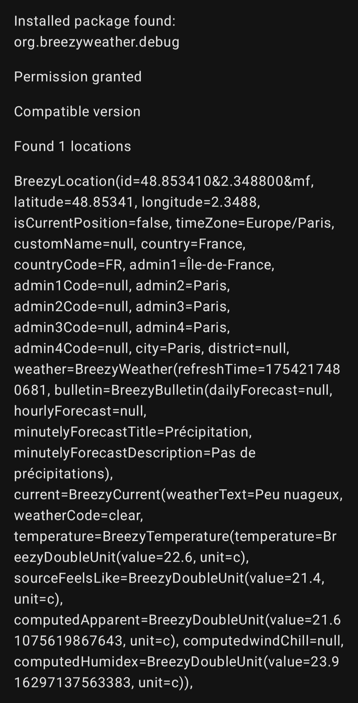

# Breezy Weather Data Sharing Library

**THIS LIBRARY IS NOT YET READY TO BE USED**

**Please check the [announcement thread](https://github.com/breezy-weather/breezy-weather/discussions/2089) if interested in participating in the testing**

This library allows you to re-use Breezy Weather data in your app.
Examples of things you can do:
- Your own widgets
- Show the weather in a dashboard
- Make your own design (for example, if you don’t like Material 3 Expressive)

The library contains what you need to use the Content Provider:
- Information about the content provider
- Json serialized objects

It also contains a sample app to showcase how it can be done, although it was intentionally made with a minimum logic to make it easy to understand.




# Usage

## Permission

Your `AndroidManifest.xml` must include:
```xml
<uses-permission android:name="org.breezyweather.READ_PROVIDER" />
```

If you want to support debug builds of Breezy Weather, you can also add:
```xml
<uses-permission android:name="org.breezyweather.debug.READ_PROVIDER" />
```

The user will need to manually allow the permission to access Breezy Weather data.


## Fetch data from content provider

### Version check

The first thing you should do is check if you currently have a library compatible with the version of content provider from the user installed Breezy Weather version.

Version of the content provider follows the following scheme:
- A major version indicates a breaking change, such as changed type or deleted non-null fields
- A minor version indicates added features/fields, renamed or deleted nullable fields. If you use Kotlinx Serialization Json, configured as shown in our sample, this change should not break your app. In the worst case, you will miss some nullable fields, which you should already be able to handle.

**Known limit:** This means that when a major version is out, Breezy Weather and your app must be updated at the same time. However, a part of users may update Breezy Weather or your app later than the other.

**TO BE COMPLETED**


### Locations

The locations URI allows you to fetch all the available locations in Breezy Weather, *without* the weather data (the field will always be null).

It supports a query parameter `limit` that allows you to limit the number of locations you would like to get.
It is highly recommended to send a `limit` parameter. Some users can have a very high number of locations!


### Weather

The weather URI allows you to get one single location with the weather data.

It supports the `selection` parameter in the form of `id=LOCATION_ID` where `LOCATION_ID` is the unique identifier you got from the locations URI.

It supports the following query parameters that allow to make the query more lightweight. It is highly recommended to use them!

- Send `withDaily=false` if you don’t need daily forecast
- Send `withHourly=false` if you don’t need hourly forecast
- Send `withMinutely=false` if you don’t need nowcasting data (precipitation minute by minute)
- Send `withAlerts=false` if you don’t need alerts
- Send `withNormals=false` if you don’t need temperature normals

It supports the following query parameters that allow to specify an unit to be used. If not specified, Breezy Weather will send data in the user-preferred unit (recommended).

- `temperatureUnit=TEMPERATURE_UNIT` where `TEMPERATURE_UNIT` is one of `c`, `f` or `k`
- `precipitationUnit=PRECIPITATION_UNIT` where `PRECIPITATION_UNIT` is one of `mm`, `cm`, `in` or `lpsqm`
- `speedUnit=SPEED_UNIT` where `SPEED_UNIT` is one of `mps`, `kph`, `kn`, `mph`, `ftps` or `bf`
- `distanceUnit=DISTANCE_UNIT` where `DISTANCE_UNIT` is one of `m`, `km`, `mi`, `nmi` or `ft`
- `pressureUnit=PRESSURE_UNIT` where `PRESSURE_UNIT` is one of `mb`, `kpa`, `hpa`, `atm`, `mmhg`, `inhg` or `kgfpsqcm`

You should always check in the `BreezyUnit` result that the unit matches, as we may update the supported units any time.

There are [plans to provide a Breezy Weather unit formatting library](https://github.com/breezy-weather/breezy-weather/issues/2087) that will ease manipulating units and have a homogenous formatting on Breezy Weather and your app sides.


# License

You can use our library in a project with any licence, BUT if you make any modification to this library, you must publish them under the same license terms.

* [GNU Lesser General Public License v3.0](/LICENSE)
* This License does not grant any rights in the trademarks, service marks, or logos of any Contributor.
* Misrepresentation of the origin of that material is prohibited, and modified versions of such material must be marked in reasonable ways as different from the original version.
